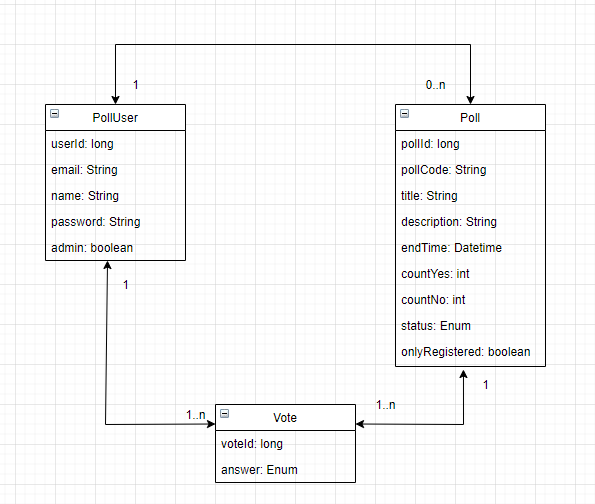
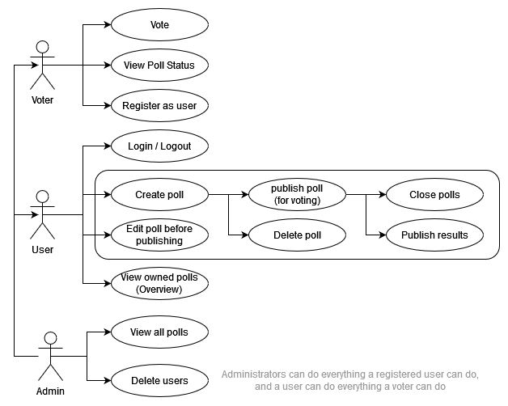
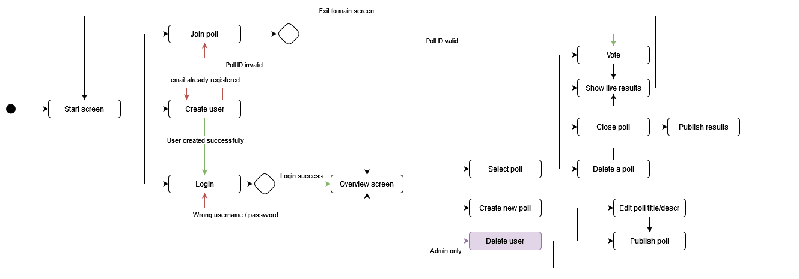
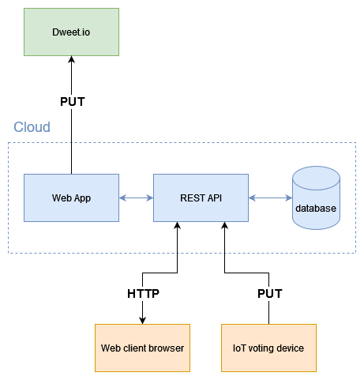

# Design Document

## The Application

## Domain Model

The domain model consists of the three objects *user*, *poll* and *vote*.

User keeps information about those registered as users of the system.
An email is used as their ID, and is what they use with a password to login.
A poll is something only a registered user is able to create,
and they will then be the owner of the poll. 
The owner is able to publish and decide when to close the poll. 
They also have the choice to restrict the poll to only registered users.
Which is necessary since the system allows for non-registered voters.
This raises the question of how many times a person should be able to vote on one poll.
We believe it is desirable to restrict a person to only one vote pr poll.
To make this possible each vote is linked to an email.

## Use Case Diagram

The use case diagram describes three types of roles. 
- Voter, which is someone without a user account.
- User, which is someone with a user account.
- Admin, which is someone with administrative rights. 

An admin should be able to do everything a user is able to do, 
and a user should be able to do everything a vote is able to do.

## Application Flow Diagram

The application flow diagram shows the different steps in the voting process. 
At the start screen the user/voter will be prompted to either login, 
register or enter a pollcode to access a poll directly.

Upon entering a valid pollcode the voter can cast a vote (yes/no) 
as shown in the Vote Page mockup.
Once voted the voter will be shown the live result of the poll, 
illustrated in the poll status page.
Alternatively, someone can choose to log in via the Login page, 
or they might register at the Signup page.

Once successfully logged in a user is forwarded to the home page. 
We envision the overview page to consist of several sub-pages, 
each showing the user’s current polls, previous polls and a template to create a new poll.
A user that’s also an administrator will have additional options to delete users and view all polls 
(not shown in mockups). From the overview page the user can perform the following actions:
- Access a selected poll and perform actions such as delete the poll, 
close the poll, vote, or access the live results.
    - Closing a poll will publish the results of the poll
- Create a new poll

## System specific architectural diagram

Could be considered an IoT level-3 system, as the web-application is not an IoT device. We only have 
one type of device, and presumably only one of them. Data is stored and worked with in the cloud in the 
cloud-based web-application.

## User Screens Mock-Ups

### Front Page
The frontpage where one can choose between sing up, login or entering a pollcode.
As of now, one has to hit enter after writing in a valid pollcode to access poll.
Might consider adding a button for it.

### Login and Sign Up Pages
Some rather standard pages for login and sign up.
Might be reasonable to only have one field for name, 
since we will most likely be adding them together.

### Home Page
The homepage is used to give an overview.
The active user can on the "current" tab see their current active polls.
On the "closed" tab they can look at closed polls. 
Has added some different variants of how it may look,
depending on if it was created with a set closing date or not. 
And how to know if the poll is only for registered users.
Considering adding the name of the active user as part ot the title.

### Create
Here is a form to create a poll. 
One checkbox gives the creator the option of only making the poll available to registered users.
Another checkbox makes it possible to decide not to have a predefined date for when the poll closes.
If the creator decides they want to manually close the poll themselves, 
they will not have the option to choose closing date and time. 

### Vote Page

### Poll Status Page

