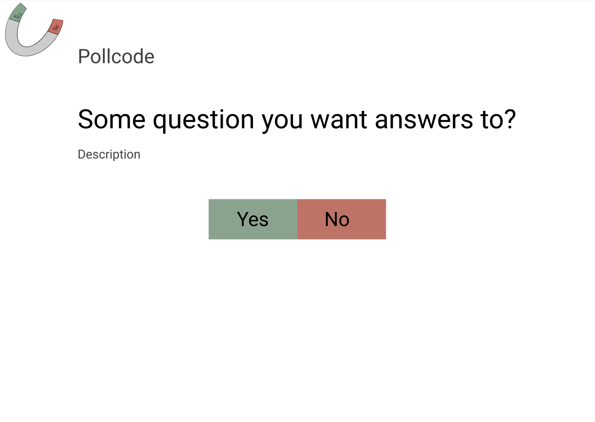
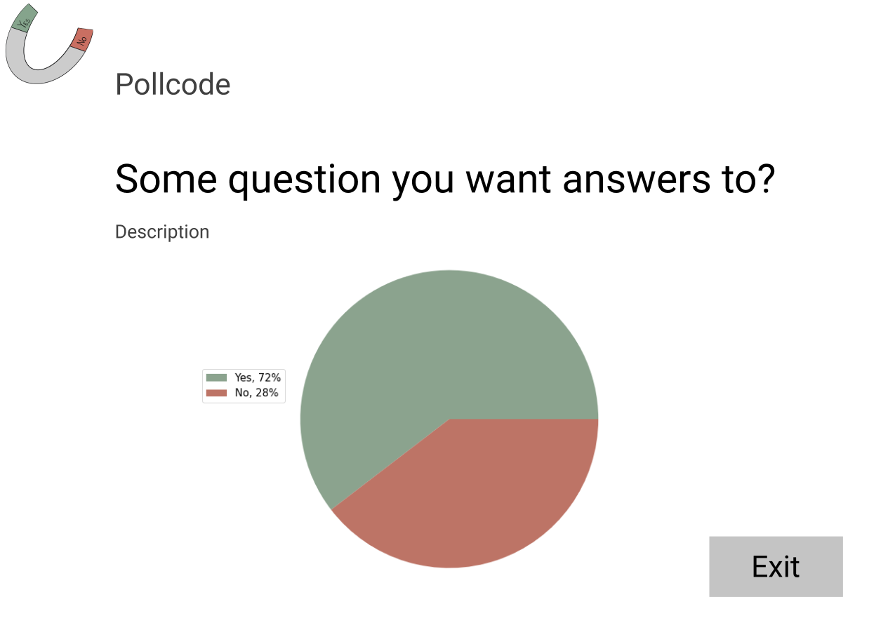

# Design Document

## The Application

## Domain Model

The domain model consists of the three objects *account*, *poll* and *vote*.

Account keeps information about those registered as users of the system.
An email is used as their ID, and is what they use with a password to login.
A poll is something only a registered user is able to create,
and they will then be the owner of the poll. 
The owner is able to publish and decide when to close the poll. 
They also have the choice to restrict the poll to only registered users.
Which is necessary since the system allows for non-registered voters.
This rises the question of how many times a person should be able to vote on one poll.
We believe it is desirable to restrict a person to only one vote pr poll.
To make this possible each vote is linked to an email.

## Use Case Diagram

The use case diagram describes three types of roles. 
- Voter, which is someone without a user account.
- User, which is someone with a user account.
- Admin, which is someone with administrative rights. 

An admin should be able to do everything a user is able to do, 
and a user should be able to do everything a vote is able to do.

## Application Flow Diagram

The application flow diagram shows the different steps in the voting process. 
At the start screen the user/voter will be prompted to either login, 
register or enter a pollcode to access a poll directly.

Upon entering a valid pollcode the voter can cast a vote (yes/no) 
as shown in the Vote Page mockup.
Once voted the voter will be shown the live result of the poll, 
illustrated in the poll status page.
Alternatively, someone can choose to log in via the Login page, 
or they might register at the Signup page.

Once successfully logged in a user is forwarded to the home page. 
We envision the overview page to consist of several sub-pages, 
each showing the user’s current polls, previous polls and a template to create a new poll.
A user that’s also an administrator will have additional options to delete users and view all polls 
(not shown in mockups). From the overview page the user can perform the following actions:
- Access a selected poll and perform actions such as delete the poll, 
close the poll, vote, or access the live results.
- Closing a poll will publish the results of the poll
- Create a new poll

## System specific architectural diagram

## User Screens Mock-Ups

### Front Page

### Login and Sign Up Pages

### Home Page

### Vote Page

### Poll Status Page

## System-specific architectural diagram
